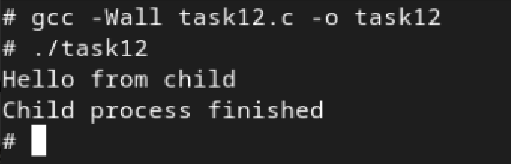

# Практична робота №10-11: Process Creation у Linux

## Зміст
1. [Умова завдання](#умова-завдання)
2. [Код програми](#код-програми)
3. [Опис](#опис)
4. [Результат](#результат)

---
## Умова завдання
Змусьте дочірній процес виконати команду echo Hello from child, передаючи параметри через execlp().
## Код програми:

```
#include <stdio.h>
#include <stdlib.h>
#include <unistd.h>
#include <sys/wait.h>

int main() {
    pid_t pid = fork();

    if (pid < 0) {
        perror("fork");
        return 1;
    } else if (pid == 0) {
        // дочірній процес
        execlp("echo", "echo", "Hello from child", (char *)NULL);
        perror("execlp");
        exit(1);
    } else {
        // батьківський процес
        int status;
        waitpid(pid, &status, 0);
        printf("Child process finished\n");
    }
    return 0;
}

```

## Опис
У цій програмі основний акцент зроблено на використанні системного виклику `execlp()`, який дозволяє замінити поточний процес виконанням зовнішньої програми. Після створення дочірнього процесу за допомогою `fork()`, саме у дочірньому процесі викликається `execlp("echo", "echo", "Hello from child", NULL)`. Цей виклик шукає програму `echo` в системних шляхах, і запускає її з переданим аргументом `"Hello from child"`. Перший параметр (`"echo"`) — це ім’я програми, яку потрібно знайти, другий (`"echo"`) — це ім’я, яке буде передано як `argv[0]`, а далі йдуть самі аргументи команди. У разі успіху `execlp()` не повертає управління назад у програму, адже виконується новий процес. Якщо щось пішло не так, то `execlp()` повертає `-1`, і виводиться повідомлення про помилку через `perror()`. 

## Результат:


