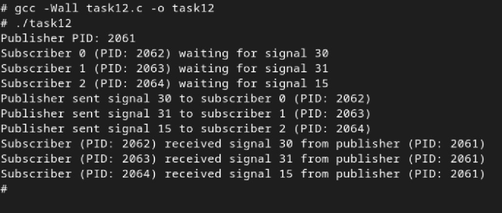

# Практична робота №12-13: Signaling – Part 1

## Зміст
1. [Умова завдання](#умова-завдання)
2. [Код програми](#код-програми)
3. [Опис](#опис)
4. [Результат](#результат)

---
## Умова завдання
Розробіть систему публікації-підписки, де кілька підписників слухають сигнали з різними пріоритетами, використовуючи SIGRTMIN + N.
## Код програми:

```
#include <stdio.h>
#include <stdlib.h>
#include <unistd.h>
#include <signal.h>
#include <sys/wait.h>
#include <string.h>

#define SUBSCRIBER_COUNT 3

pid_t subscribers[SUBSCRIBER_COUNT];
int signals[SUBSCRIBER_COUNT] = {SIGUSR1, SIGUSR2, SIGTERM};

void subscriber_handler(int signo, siginfo_t *info, void *context) {
    printf("Subscriber (PID: %d) received signal %d from publisher (PID: %d)\n",
           getpid(), signo, info->si_pid);
}

void create_subscriber(int index, int signal_number) {
    pid_t pid = fork();
    if (pid == 0) {
        struct sigaction sa;
        memset(&sa, 0, sizeof(sa));
        sa.sa_flags = SA_SIGINFO;
        sa.sa_sigaction = subscriber_handler;
        sigemptyset(&sa.sa_mask);
        sigaction(signal_number, &sa, NULL);

        printf("Subscriber %d (PID: %d) waiting for signal %d\n",
               index, getpid(), signal_number);

        while (1) {
            pause();
        }
        exit(0);
    } else if (pid > 0) {
        subscribers[index] = pid;
    } else {
        perror("fork");
        exit(EXIT_FAILURE);
    }
}

int main() {
    printf("Publisher PID: %d\n", getpid());

    for (int i = 0; i < SUBSCRIBER_COUNT; i++) {
        create_subscriber(i, signals[i]);
        sleep(1);  // щоб уникнути одночасного виводу
    }

    sleep(2);

    for (int i = 0; i < SUBSCRIBER_COUNT; i++) {
        kill(subscribers[i], signals[i]);
        printf("Publisher sent signal %d to subscriber %d (PID: %d)\n",
               signals[i], i, subscribers[i]);
    }

    sleep(2);

    for (int i = 0; i < SUBSCRIBER_COUNT; i++) {
        kill(subscribers[i], SIGKILL);
        waitpid(subscribers[i], NULL, 0);
    }

    return 0;
}


```

## Опис
Ця програма реалізовує систему публікації-підписки, де головний процес створює три дочірні процеси, кожен із яких налаштований на отримання унікального реального сигналу `SIGRTMIN + N`. Після створення, підписники переходять у режим очікування (`pause()`) і реагують на відповідний сигнал, виводячи повідомлення з інформацією про сигнал і PID видавця. Видавець після затримки надсилає кожному підписнику його сигнал за допомогою `kill()`, і ті відповідно його обробляють через спеціально визначений обробник `sigaction()` з прапором `SA_SIGINFO`. Після демонстрації взаємодії, видавець завершує роботу всіх підписників, надсилаючи їм `SIGKILL`. 

## Результат:


