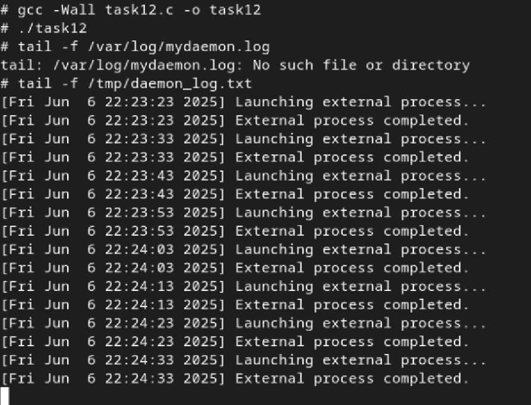

# Практична робота №14: Timers

## Зміст
1. [Умова завдання](#умова-завдання)
2. [Код програми](#код-програми)
3. [Опис](#опис)
4. [Результат](#результат)

---
## Умова завдання
Створіть daemon, який запускає зовнішній процес через задані інтервали часу, логуючи запуск і завершення.
## Код програми:

```
#include <stdio.h>
#include <stdlib.h>
#include <unistd.h>
#include <sys/types.h>
#include <sys/wait.h>
#include <sys/stat.h>
#include <time.h>
#include <fcntl.h>
#include <string.h>
#include <signal.h>

#define LOGFILE "/tmp/daemon_log.txt"
#define INTERVAL 10

void write_log(const char *message) {
    FILE *log = fopen(LOGFILE, "a");
    if (log == NULL) return;

    time_t now = time(NULL);
    char *timestr = ctime(&now);
    timestr[strcspn(timestr, "\n")] = 0;

    fprintf(log, "[%s] %s\n", timestr, message);
    fclose(log);
}

void daemonize() {
    pid_t pid = fork();
    if (pid < 0) exit(EXIT_FAILURE);
    if (pid > 0) exit(EXIT_SUCCESS);

    if (setsid() < 0) exit(EXIT_FAILURE);

    signal(SIGCHLD, SIG_IGN);
    signal(SIGHUP, SIG_IGN);

    pid = fork();
    if (pid < 0) exit(EXIT_FAILURE);
    if (pid > 0) exit(EXIT_SUCCESS);

    umask(0);
    chdir("/");

    close(STDIN_FILENO);
    close(STDOUT_FILENO);
    close(STDERR_FILENO);
}

int main() {
    daemonize();
    while (1) {
        write_log("Launching external process...");

        pid_t pid = fork();
        if (pid == 0) {
            execlp("echo", "echo", "Hello from daemon", (char *)NULL);
            exit(EXIT_FAILURE);
        } else if (pid > 0) {
            int status;
            waitpid(pid, &status, 0);
            write_log("External process completed.");
        } else {
            write_log("Failed to fork.");
        }

        sleep(INTERVAL);
    }
    return 0;
}


```

## Опис
Програма запускає себе як демон — відокремлюється від термінала, закриває стандартні потоки і працює у фоновому режимі, кожні 10 секунд форкає дитячий процес, який виконує команду `echo`, а батьківський процес записує в лог файл `/tmp/daemon_log.txt` повідомлення про запуск і завершення цієї команди з мітками часу. Щоб дивитися лог у реальному часі  - `tail -f /tmp/daemon_log.txt`.


## Результат:


