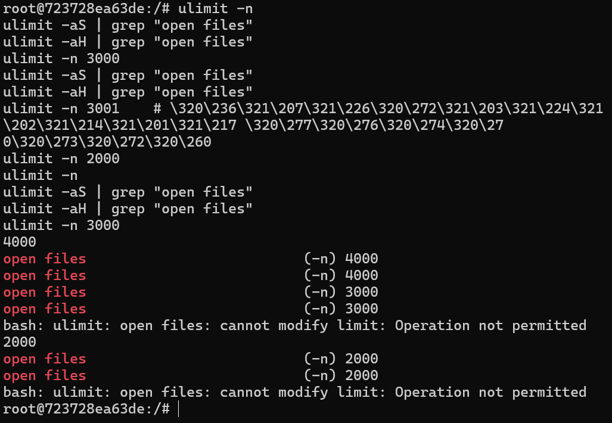
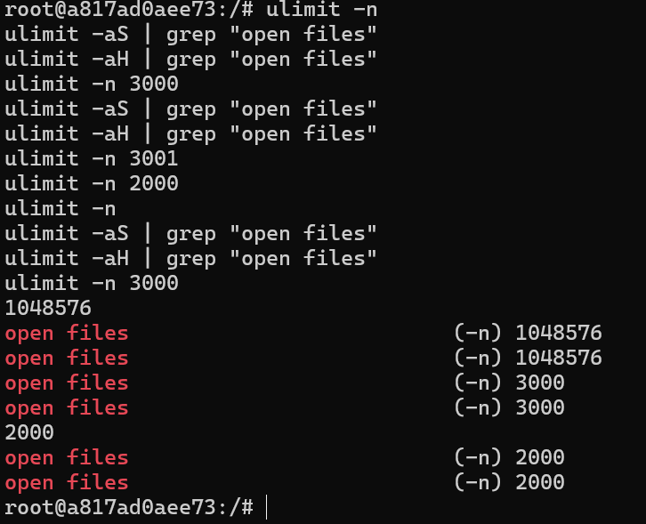
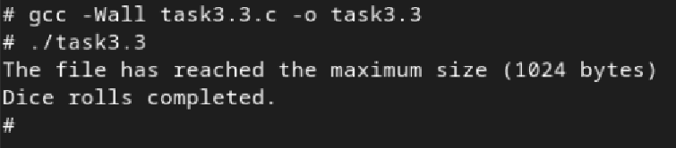
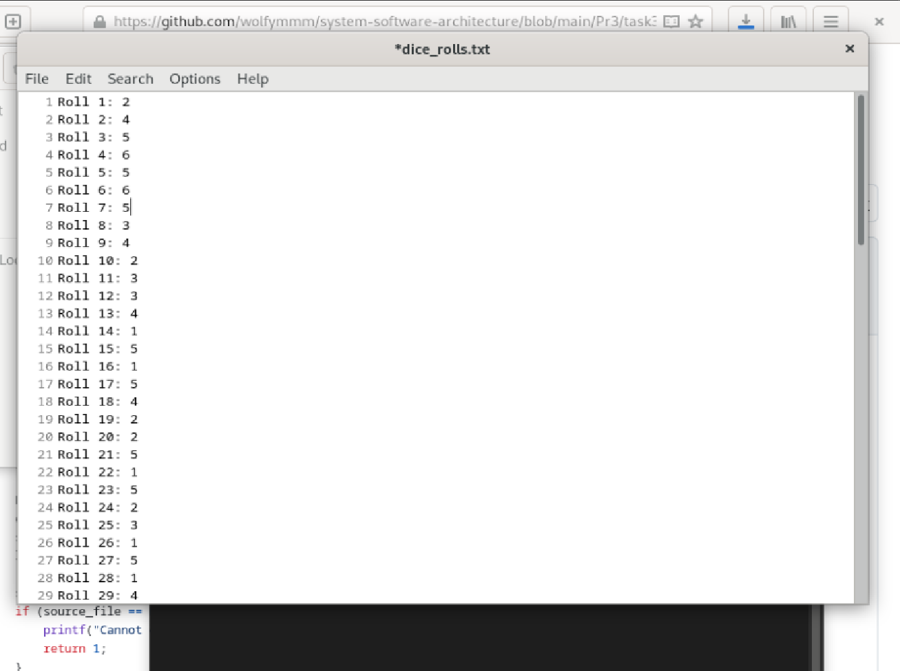
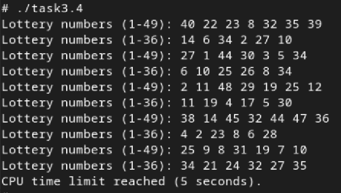
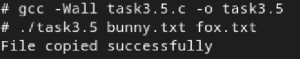
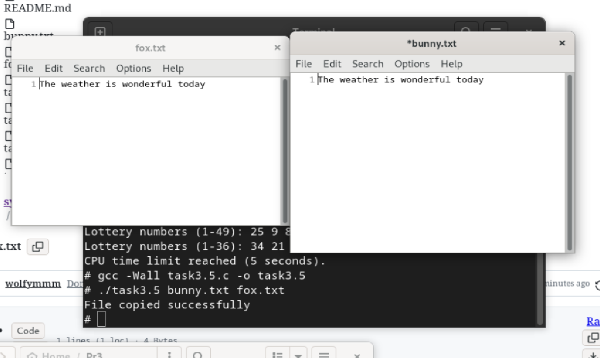
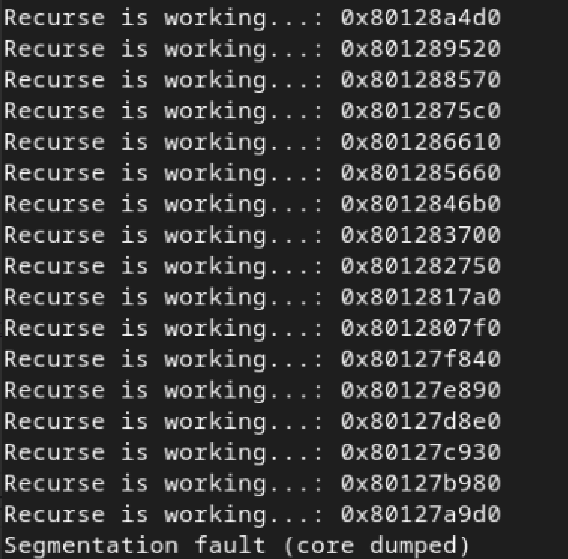

# Практична робота №3: Дослідження обмежень ресурсів у середовищі Docker

## Зміст
1. [Ulimit у Docker](#ulimit-у-docker)
2. [Кидання кубика з обмеженням на розмір файлу](#кидання-кубика-з-обмеженням-на-розмір-файлу)
3. [Лотерея з обмеженням CPU](#лотерея-з-обмеженням-cpu)
4. [Копіювання файлу з обробкою помилок](#копіювання-файлу-з-обробкою-помилок)
5. [Стекове переповнення](#стекове-переповнення)
6. [Завдання по варіантах](#завдання-по-варіантах)

---
## Ulimit у Docker
### Запуск Ulimit без root-прав:

### Запуск Ulimit з root-правами:

## Кидання кубика з обмеженням на розмір файлу

Програма імітує кидки грального кубика та записує результати у текстовий файл `dice_rolls.txt`. Вона виконує до 100 кидків, генеруючи випадкові числа від 1 до 6 за допомогою функції `rand()`, попередньо ініціалізованої поточним часом. Перед кожним записом у файл програма перевіряє його поточний розмір. Якщо розмір досягає або перевищує встановлене обмеження у 1024 байти, подальший запис припиняється, і виводиться повідомлення про досягнення ліміту. Файл відкривається в режимі дописування, тож нові кидки додаються до вже існуючих. Після завершення роботи файл закривається, а користувач отримує повідомлення про успішне завершення симуляції.
### Результат:

## Лотерея з обмеженням CPU

Програма моделює генерацію лотерейних номерів у двох різних форматах з обмеженням за часом роботи процесора. Вона створює два масиви випадкових чисел: перший — з 7 унікальних чисел у діапазоні від 1 до 49, другий — з 6 унікальних чисел у діапазоні від 1 до 36. Генерація повторюється в циклі, поки не буде досягнуто ліміту часу, встановленого в 5 секунд (`MAX_CPU_TIME`). Для кожного нового набору чисел перевіряється, чи не повторюються значення в межах масиву. Якщо знаходиться дубль, поточний індекс зменшується, і генерація повторюється для цієї позиції. Час від початку роботи програми обчислюється за допомогою функцій `time()` і `difftime()`. Після кожної ітерації результати виводяться в консоль, а виконання призупиняється на 1 секунду (`sleep(1)`), щоб уникнути надто швидкої генерації. Коли встановлений час вичерпується, програма завершує роботу з відповідним повідомленням.
### Результат:

## Копіювання файлу з обробкою помилок

Програма виконує копіювання файлу з перевіркою на перевищення допустимого розміру. Вона приймає два аргументи командного рядка: шлях до файлу-джерела та шлях до файлу-призначення. Програма відкриває вхідний файл для читання у двійковому режимі та відкриває вихідний файл для запису. Копіювання здійснюється блоками по 1024 байти, і паралельно ведеться підрахунок загального розміру скопійованих даних. Якщо під час копіювання розмір перевищує встановлений ліміт у 1 мегабайт, програма зупиняє процес, виводить повідомлення про перевищення ліміту та завершується з помилкою. Також обробляються помилки при відкритті файлів для читання або запису, а також при збої у записі. Якщо всі операції виконуються успішно, програма завершується повідомленням про успішне копіювання файлу.
### Результат:

## Стекове переповнення

Програма демонструє нескінченну рекурсію, яка неминуче призводить до `stack overflow✨`. Програма починає виконання з функції main(), яка викликає функцію recurse(). Усередині recurse() створюється локальний масив array розміром 1000 цілих елементів, після чого функція знову викликає саму себе. Кожен рекурсивний виклик створює новий масив у стеку, споживаючи все більше пам’яті. Також кожного разу виводиться адреса цього масиву, що показує зміщення в стеку.
### Результат:

## Завдання по варіантах

Програма створює 1000 текстових файлів з унікальними іменами (від `file_0.txt` до `file_999.txt`), записуючи в кожен з них простий рядок з номером файлу. Після створення файлів програма намагається одночасно відкрити всі ці файли для читання, зчитати з кожного перший рядок і вивести його на екран. Якщо відкриття будь-якого файлу не вдається, програма припиняє спроби відкриття решти файлів. Після зчитування всі відкриті файли закриваються. Програма демонструє роботу з файловою системою, однак при відкритті великої кількості файлів одночасно може виникнути системне обмеження на кількість відкритих дескрипторів, що призведе до помилки.

### Результат:
