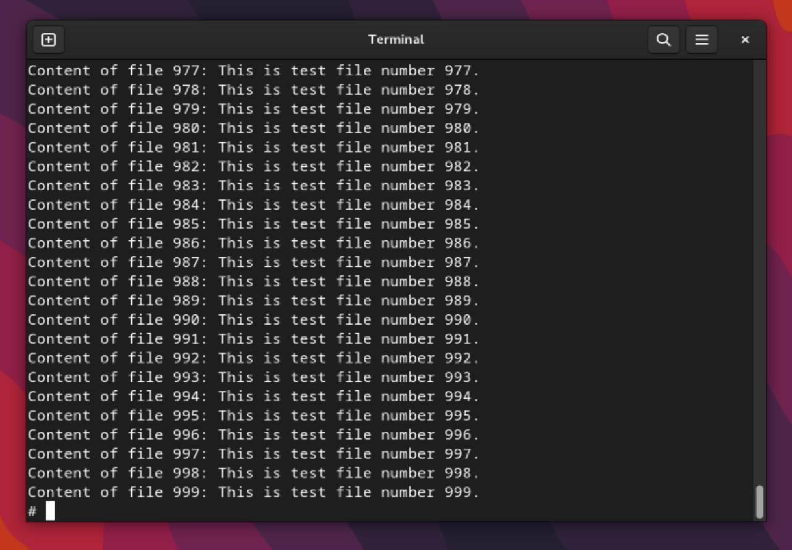

# Практична робота №3: Дослідження обмежень ресурсів у середовищі Docker

## Зміст
1. [Ulimit у Docker](#ulimit-у-docker)
2. [Кидання кубика з обмеженням на розмір файлу](#кидання-кубика-з-обмеженням-на-розмір-файлу)
3. [Лотерея з обмеженням CPU](#лотерея-з-обмеженням-cpu)
4. [Копіювання файлу з обробкою помилок](#копіювання-файлу-з-обробкою-помилок)
5. [Стекове переповнення](#стекове-переповнення)
6. [Завдання по варіантах](#завдання-по-варіантах)

---
## Ulimit у Docker
Запуск Ulimit без root-прав:

Запуск Ulimit з root-правами:

## Кидання кубика з обмеженням на розмір файлу

## Лотерея з обмеженням CPU

## Копіювання файлу з обробкою помилок

## Стекове переповнення

## Завдання по варіантах

