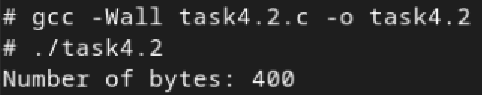
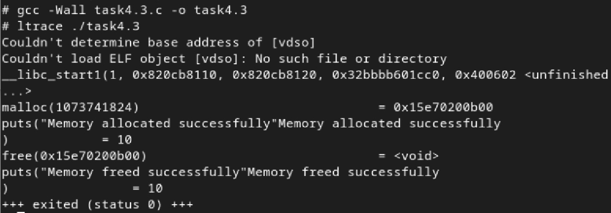
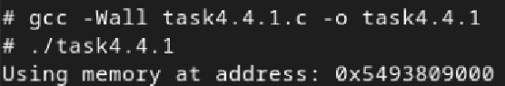
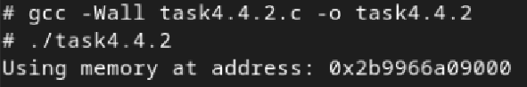
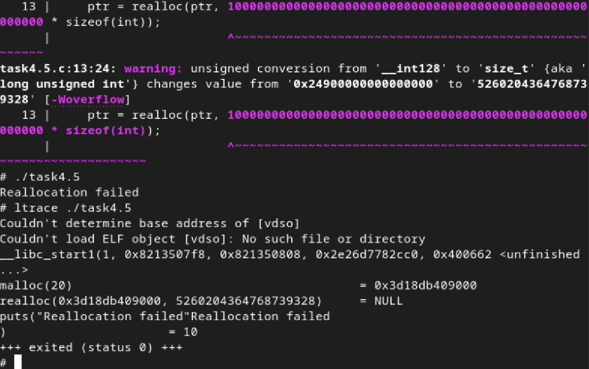
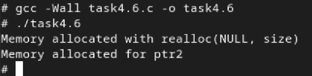
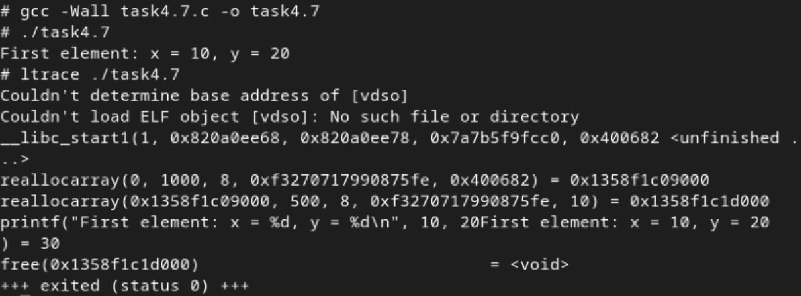
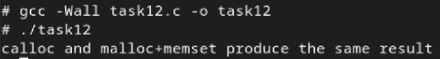

# Практична робота №4: Робота з пам'яттю

## Зміст
1. [Максимальний обсяг пам'яті для malloc(3)](#максимальний-обсяг-пам'яті-для-malloc3)
2. [Множення та переповнення при malloc](#множення-та-переповнення-при-malloc)
3. [Використання malloc(0)](#використання-malloc0)
4. [Виявлення помилок у коді](#виявлення-помилок-у-коді)
5. [Поведінка realloc(3) при помилці](#поведінка-realloc3-при-помилці)
6. [Використання realloc(3) з NULL або 0](#використання-realloc3-з-NULL-або-0)
7. [Переписання коду](#переписання-коду)
8. [Завдання по варіантах](#завдання-по-варіантах)

---
## Максимальний обсяг пам'яті для malloc(3)

1. Теоретично максимальний обсяг пам'яті, який можна виділити за один виклик malloc(3), залежить від архітектури системи, типу операційної системи та типу процесора. В основному, максимальний розмір пам'яті визначається кількістю бітів у вказівнику, тобто розміром адресного простору процесора.
2. Чому 8 ескабайт? Це відбувається тому, що найстарший біт адресного простору часто використовується для спеціальних цілей, таких як маркування певних областей пам'яті чи інші технічні потреби.
Тому хоча теоретично 64-бітова система може підтримувати до 16 ексабайт пам'яті, на практиці максимальний розмір блоку, який можна виділити за один виклик malloc(), обмежений операційною системою та архітектурними особливостями, і це значення часто складає 8 ексабайтів.
### Результат:


## Множення та переповнення при malloc

1. Якщо передати від'ємне значення в malloc(), результат буде непередбачуваним, оскільки значення типу size_t є беззнаковим, і не можна передавати від'ємні числа. Якщо значення буде інтерпретоване як від'ємне, воно перетвориться на дуже велике двійкове число. Це призведе до того, що система спробує виділити надмірно велику кількість пам'яті, що, ймовірно, викличе помилку через відмову в операції виділення пам'яті.
2. Якщо num оголошено як цілочисельна змінна, переповнення може статися, якщо результат множення перевищить максимальне значення для цього типу.  У найгіршому випадку це може призвести до непередбачуваної поведінки системи.
### Результат:



## Використання malloc(0)

1. malloc(0) поверне "порожній" блок пам'яті або NULL.
### Компіляція та запуск через ltrace:

2. malloc виділяє пам’ять, puts виводить повідомлення про успішне виділення, free звільняє пам’ять, і ще один puts підтверджує звільнення.

## Виявлення помилок у коді

Проблема цього коду полягає в тому, що він не має практичного сенсу використання пам’яті — виділена пам’ять одразу ж звільняється, не використовуючись по суті. 

### Демонстрація проблеми:
```
#include <stdio.h>
#include <stdlib.h>

int main() {
    void *ptr = NULL;
    int n = 10;

    while (1) {
        if (!ptr)
            ptr = malloc(n);
        if (ptr) {
            printf("Using memory at address: %p\n", ptr);
        }
        free(ptr);
        ptr = NULL;
        break;
    }
    return 0;
}
```
### Результат:

1. Даремне використання while (1) — цикл виконується лише один раз, бо всередині є break, тобто цикл зайвий.

2. Виділення і звільнення одразу — пам’ять виділяється, потім виводиться її адреса, і одразу ж звільняється. Це неефективно, оскільки виділення не використовується по суті для збереження чи обробки даних.

3. Немає перевірки на помилки malloc — хоча перевірка if (ptr) є, бажано також обробляти ситуацію, коли malloc не виділяє пам’ять, із виведенням повідомлення про помилку.

4. Немає сенсу у ptr = NULL; перед break — бо програма одразу завершується, і пам’ять все одно очищується при завершенні.

### Правильний варіант коду:
```
#include <stdio.h>
#include <stdlib.h>

int main() {
    void *ptr = NULL;
    int n = 10;

    ptr = malloc(n);
    if (!ptr) {
        printf("Memory allocation failed\n");
        return 1;
    }

    while (1) {
        if (ptr) {
            printf("Using memory at address: %p\n", ptr);
        }

        free(ptr);
        ptr = NULL;

        break;
    }
    return 0;
}
```
### Результат:


## Поведінка realloc(3) при помилці
Якщо realloc повертає NULL, то оригінальний вказівник втрачається, оскільки результат realloc одразу записується назад у ptr.
Це означає, що виділена раніше пам’ять втрачається, і її вже не можна звільнити, бо немає вказівника на неї.

У своєму коді я спеціально вказала астрономічно велике число, щоб realloc(3) 100% не зміг виділити пам'ять.

### Демонстрація проблеми:
```
#include <stdio.h>
#include <stdlib.h>

int main() {
    int *ptr = malloc(5 * sizeof(int));
    if (!ptr) {
        printf("Memory allocation failed\n");
        return 1;
    }
    for (int i = 0; i < 5; i++) {
        ptr[i] = i + 1;
    }
    ptr = realloc(ptr, 10000000000000000000000000000000000000000000000000000000000000000000 * sizeof(int));

    if (!ptr) {
        printf("Reallocation failed\n");
    } else {
        printf("Reallocation successful\n");
        free(ptr);
    }

    return 0;
}

```


### Результат:


## Використання realloc(3) з NULL або 0
1. realloc(NULL, size) — виділяє нову пам’ять.
2. realloc(ptr, 0) — згідно з POSIX, поводиться як free(ptr) і повертає NULL.

### Результат:


## Переписання коду

### Результат:


Програма створює динамічний масив із 1000 структур `sbar`, кожна з яких має два поля — `x` і `y`, потім переалокує цей масив до 500 елементів, ініціалізує перший елемент значеннями `x = 10`, `y = 20` і виводить їх на екран, після чого звільняє пам’ять.

## Завдання по варіантах
### Тест:
```
#include <stdio.h>
#include <stdlib.h>
#include <string.h>

int main() {
    int n = 10;

    // Використання calloc
    int *arr1 = (int *)calloc(n, sizeof(int));
    if (!arr1) {
        printf("calloc failed\n");
        return 1;
    }

    // Використання malloc + memset
    int *arr2 = (int *)malloc(n * sizeof(int));
    if (!arr2) {
        printf("malloc failed\n");
        free(arr1);
        return 1;
    }
    memset(arr2, 0, n * sizeof(int));

    int equal = 1;
    for (int i = 0; i < n; i++) {
        if (arr1[i] != arr2[i]) {
            equal = 0;
            break;
        }
    }

    if (equal) {
        printf("calloc and malloc+memset produce the same result\n");
    } else {
        printf("Results differ\n");
    }

    free(arr1);
    free(arr2);

    return 0;
}
```

Тест показав, що calloc і malloc+memset видають однаковий результат
### Результат:
