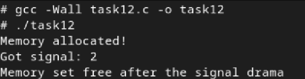

# Практична робота №5: Про помилки роботи з пам’яттю в Linux та засоби їх усунення

## Зміст
1. [Умова завдання](#умова-завдання)
2. [Код програми](#код-програми)
3. [Опис](#опис)
4. [Результат](#результат)

---
## Умова завдання
 Побудуйте код, який динамічно виділяє пам’ять, але втрати трапляються лише при викиданні виключення або сигнала.

## Код програми:

```
#include <stdio.h>
#include <stdlib.h>
#include <signal.h>
#include <setjmp.h>

jmp_buf jumpyJumpyBuffer;

void whoopsSignalHandler(int sig) {
    printf("Got signal: %d\n", sig);
    longjmp(jumpyJumpyBuffer, 1);
}

void memoryAllocatorMagic() {
    int *memoryPointer = (int *)malloc(100 * sizeof(int));
    if (memoryPointer == NULL) {
        perror("Memory allocation failed... Oops");
        exit(1);
    }

    // Імітуємо ситуацію, коли пам'ять буде втрачена через виключення або сигнал
    printf("Memory allocated!\n");
    if (setjmp(jumpyJumpyBuffer) == 0) {
        raise(SIGINT);
    } else {
        // Тут ми повертаємось після отримання сигналу
        free(memoryPointer);
        printf("Memory set free after the signal drama\n");
    }
}

int main() {
    signal(SIGINT, whoopsSignalHandler);
    memoryAllocatorMagic();
    return 0;
}
```

## Опис
Програма демонструє обробку сигналів із використанням механізмів `setjmp` та `longjmp`, які дозволяють повертатися до певної точки виконання після сигналу. У функції `memoryAllocatorMagic` виділяється пам’ять, потім викликається `raise(SIGINT)`, щоб зімітувати сигнал. Обробник сигналу `whoopsSignalHandler` перехоплює сигнал, виводить повідомлення та за допомогою `longjmp` повертається до точки `setjmp`, що дозволяє уникнути втрати пам’яті. Після повернення програма очищує пам'ять.


## Результат:
