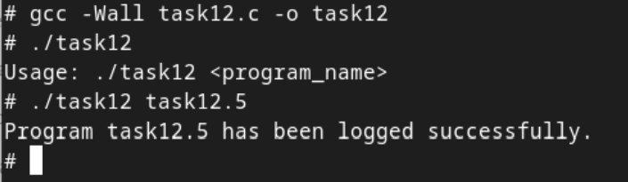

# Практична робота №7: Дослідження, моделювання та нестандартні підходи до аналізу процесів, файлових систем, безпеки та ресурсів в Linux

## Зміст
1. [Умова завдання](#умова-завдання)
2. [Код програми](#код-програми)
3. [Опис](#опис)
4. [Результат](#результат)

---
## Умова завдання
Зробіть систему логування запусків програм, яка не використовує жодного лог-файлу.
## Код програми:

```
#include <stdio.h>
#include <stdlib.h>
#include <syslog.h>
#include <time.h>

// Функція для запису логів у системний журнал
void log_program_start(const char *program_name) {
    time_t now;
    struct tm *time_info;
    char time_str[20];

    time(&now);
    time_info = localtime(&now);
    strftime(time_str, sizeof(time_str), "%Y-%m-%d %H:%M:%S", time_info);

    openlog("ProgramLog", LOG_PID | LOG_CONS, LOG_USER);
    syslog(LOG_INFO, "Program '%s' started at %s", program_name, time_str);
    closelog();
}

int main(int argc, char *argv[]) {
    if (argc < 2) {
        printf("Usage: %s <program_name>\n", argv[0]);
        return 1;
    }
    log_program_start(argv[1]);

    printf("Program %s has been logged successfully.\n", argv[1]);
    return 0;
}

```

## Опис
Програма виконує логування запусків без створення лог-файлів, оскільки використовує системну функцію `syslog()` для запису повідомлень у системний журнал операційної системи FreeBSD. Вона передає дані про запуск програми до системного журналу через стандартні системні служби, не створюючи та не керуючи власними файлами логів.

## Результат:


Примітка: у якості файлу для логування я використала програму з практичної роботи №5