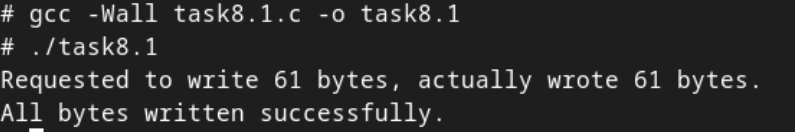
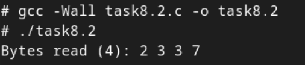
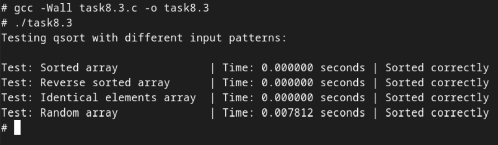
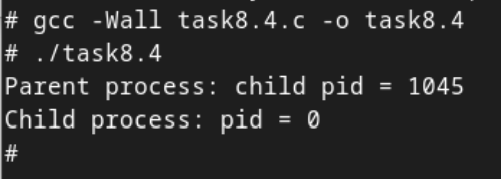

# Практична робота №8:  Системні виклики в UNIX/POSIX (файлові операції, fork(), qsort(), write(), read(), lseek() тощо

## Зміст
1. [Демонстрація часткового запису у системному виклику write()](#демонстрація-часткового-запису-у-системному-виклику-write())
2. [Використання lseek та read для зчитування частини файлу](#використання-lseek-та-read-для-зчитування-частини-файлу)
3. [Дослідження продуктивності qsort](#дослідження-продуктивності-qsort)
4. [Дослідження роботи fork()](#дослідження-роботи-fork())
5. [Завдання по варіантах](#завдання-по-варіантах)

---
## Демонстрація часткового запису у системному виклику write()

Так, `count = write(fd, buffer, nbytes);` може повернути значення, відмінне від `nbytes`. Це тому, що `write()` не гарантує запис усіх байтів за один раз, особливо якщо файл відкрито з прапором `O_NONBLOCK`. У такому режимі операція запису не блокується і, якщо неможливо записати всі дані одразу, `write` записує тільки частину і повертає кількість реально записаних байтів. Саме тому програма перевіряє, чи `burrito < tamano`, щоб виявити частковий запис.

### Результат



## Використання lseek та read для зчитування частини файлу

Після виклику `lseek(fd, 3, SEEK_SET);` позиція файлового покажчика переміститься на четвертий байт файлу, тобто на байт зі значенням `2`. Тоді виклик `read(fd, &buffer, 4);` прочитає 4 байти, починаючи з цього місця, отже у буфері будуть значення `{2, 3, 3, 7}`, що відповідає четвертому, п’ятому, шостому та сьомому байтам файлу.

### Результат


## Дослідження продуктивності qsort

Програма автоматично генерує різні типи масивів — відсортовані за зростанням, відсортовані за спаданням, з однаковими елементами та випадкові — і вимірює час сортування кожного з них за допомогою бібліотечної функції `qsort` з універсальною функцією порівняння, яка працює з вказівниками типу `void*`. Після сортування програма перевіряє коректність результату та виводить час виконання для кожного тесту. Таким чином вона досліджує, які вхідні дані є найповільнішими для алгоритму швидкого сортування, автоматизуючи процес підбору і аналізу, а також реалізує набір тестів для перевірки правильності роботи `qsort`.

### Результат


## Дослідження роботи fork()

При успішному виклику fork() програма створює новий процес — дочірній. У дочірньому процесі fork() повертає 0, а у батьківському — PID дочірнього процесу, який буде більшим за 0. Тому програма виведе два рядки: один з pid = 0 (з дочірнього процесу), інший — з PID дочірнього процесу (з батьківського). Порядок виводу може бути довільним, бо процеси виконуються паралельно. Якщо виклик fork() не вдався, виведеться повідомлення про помилку, і програма завершиться з помилкою.

### Результат


## Завдання по варіантах

### Умова завдання
Напишіть програму, яка симулює часткове зчитування з файлу з паралельним записом з іншого процесу.

### Код програми:
```
#include <stdio.h>
#include <stdlib.h>
#include <unistd.h>
#include <fcntl.h>
#include <string.h>
#include <sys/types.h>
#include <sys/wait.h>
#include <errno.h>

#define FILENAME "test_file.txt"
#define BUFFER_SIZE 100
#define WRITE_DATA "This is data written by the writer process.\n"

void reader_process() {
    char buffer[BUFFER_SIZE];
    int fd = open(FILENAME, O_RDONLY);
    if (fd == -1) {
        perror("Failed to open file for reading");
        exit(1);
    }

    printf("Reader process: Reading the file...\n");

    ssize_t bytes_read;
    while ((bytes_read = read(fd, buffer, sizeof(buffer) - 1)) > 0) {
        buffer[bytes_read] = '\0';  // Додаємо нульовий символ для коректного виведення
        printf("Reader process read: %s", buffer);
        sleep(1);  // Затримка для симуляції повільного зчитування
    }

    if (bytes_read == -1) {
        perror("Failed to read the file");
        close(fd);
        exit(1);
    }

    close(fd);
}

void writer_process() {
    int fd = open(FILENAME, O_WRONLY | O_APPEND | O_CREAT, 0644);
    if (fd == -1) {
        perror("Failed to open file for writing");
        exit(1);
    }

    printf("Writer process: Writing to the file...\n");

    ssize_t bytes_written = write(fd, WRITE_DATA, strlen(WRITE_DATA));
    if (bytes_written == -1) {
        perror("Failed to write to the file");
        close(fd);
        exit(1);
    }

    close(fd);
}

int main() {
    // Створення файлу для тесту
    int fd = open(FILENAME, O_WRONLY | O_CREAT | O_TRUNC, 0644);
    if (fd == -1) {
        perror("Failed to create the test file");
        exit(1);
    }
    close(fd);

    pid_t reader_pid = fork();
    if (reader_pid == -1) {
        perror("Failed to fork reader process");
        exit(1);
    }

    if (reader_pid == 0) {
        reader_process();
        exit(0);
    }
    sleep(1);

    pid_t writer_pid = fork();
    if (writer_pid == -1) {
        perror("Failed to fork writer process");
        exit(1);
    }

    if (writer_pid == 0) {
        writer_process();
        exit(0);
    }
    wait(NULL);
    wait(NULL);
    printf("Main process: Both reader and writer have finished.\n");

    return 0;
}
```

### Опис
Програма моделює ситуацію, коли один процес частково зчитує вміст файлу, а інший — паралельно записує в нього нові дані. 

На початку головна функція створює файл `test_file.txt`, очищаючи його. 

Потім за допомогою `fork()` створюється перший дочірній процес — читач, який відкриває файл для читання і повільно, з затримкою, зчитує вміст блоками. 

Через секунду після старту читача створюється другий процес — записувач, який відкриває той самий файл у режимі дописування і записує рядок тексту. Завдяки затримці читача, запис відбувається "на ходу", і частина вмісту може бути зчитана ще до дописування, що дозволяє спостерігати реальний приклад паралельного доступу до файлу. 

### Результат


