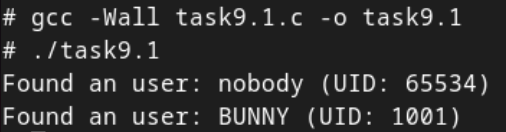
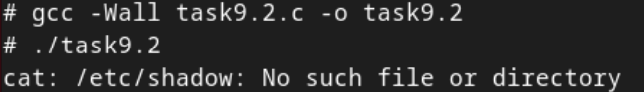
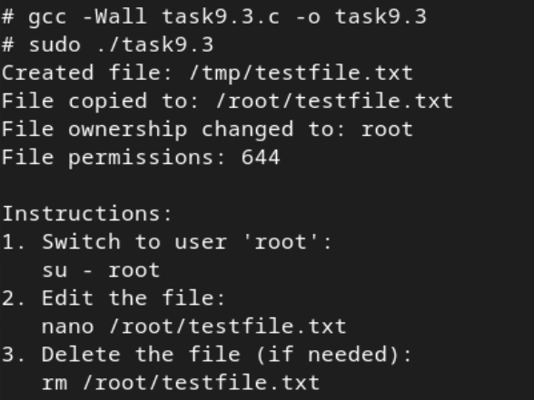
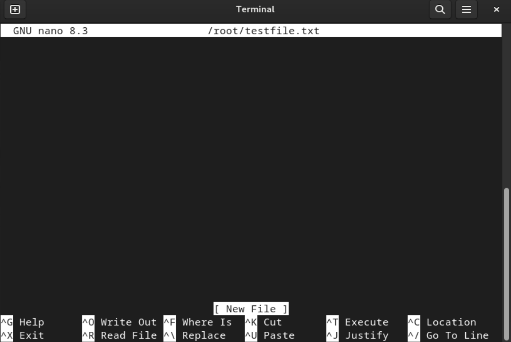
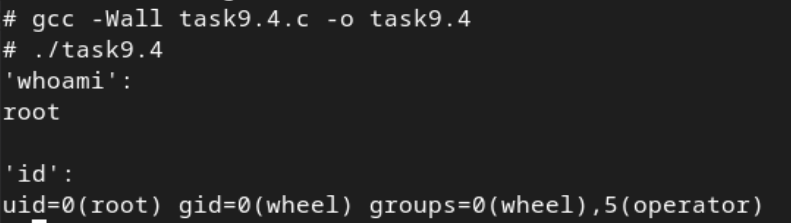
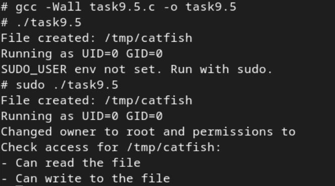
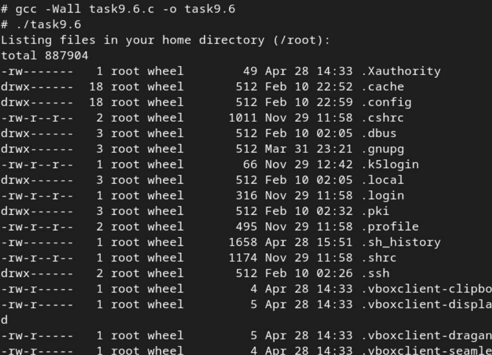
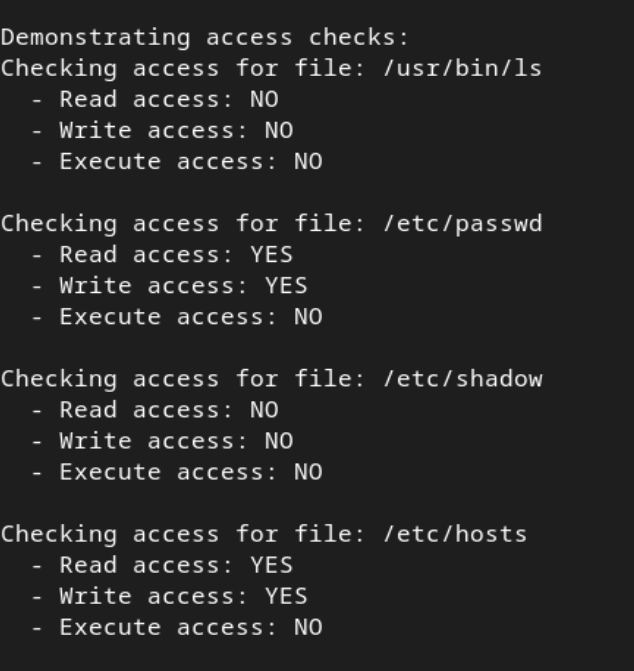
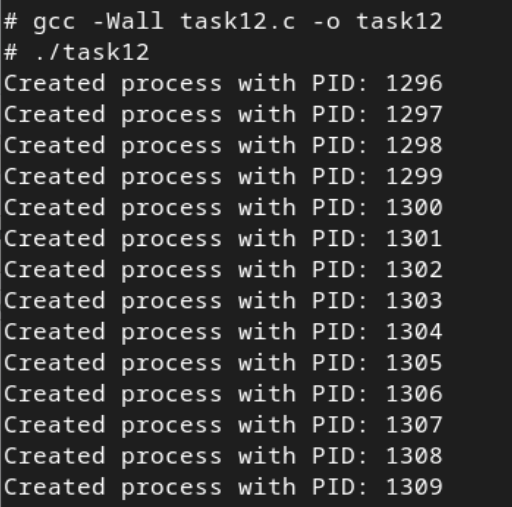
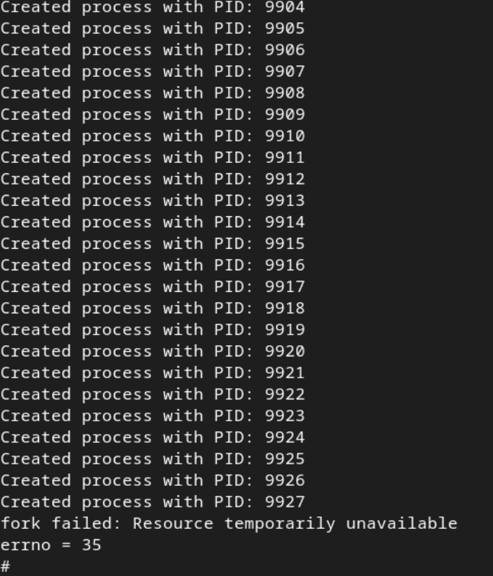

# Практична робота №9:  Роль прав доступу при виконанні скриптів у UNIX/Linux

## Зміст
1. [Пошук звичайних користувачів у системі за допомогою getpwent](#пошук-звичайних-користувачів-у-системі-за-допомогою-getpwent)
2. [Отримання вмісту захищеного файлу з використанням sudo та popen](#отримання-вмісту-захищеного-файлу-з-використанням-sudo-та-popen)
3. [Дослідження прав доступу при зміні власника файлу](#дослідження-прав-доступу-при-зміні-власника-файлу)
4. [Перевірка облікового запису користувача через команди whoami та id](#перевірка-облікового-запису-користувача-через-команди-whoami-та-id)
5. [Адміністрування доступу до файлів](#адміністрування-доступу-до-файлів)
6. [Дослідження прав користувача](#дослідження-прав-користувача)
7. [Завдання по варіантах](#завдання-по-варіантах)

---
## Пошук звичайних користувачів у системі за допомогою getpwent

Програма читає всі облікові записи користувачів системи, використовуючи функції для послідовного отримання інформації з бази користувачів (`getpwent()`), і визначає, чи існують інші звичайні користувачі з UID, більшим за 1000, окрім поточного користувача, який запускає програму. Якщо такі користувачі знайдені, їх імена та UID виводяться на екран, інакше повідомляється, що інших користувачів немає.

### Результат



## Отримання вмісту захищеного файлу з використанням sudo та popen

Програма виконує команду `cat /etc/shadow` для читання вмісту захищеного системного файлу, що містить паролі користувачів. Але, у FreeBSD немає `etc/shadow`, тому цей код може працювати тільки на Linux.

### Результат


## Дослідження прав доступу при зміні власника файлу

Програма створює тимчасовий файл від імені `root` у каталозі `/tmp/`, копіює його у домашній каталог звичайного користувача, змінює власника файлу на цього користувача і виводить інструкції для перевірки можливості редагування та видалення файлу під обліковим записом звичайного користувача.

Програма також перевіряє UID користувача та вимагає запуску через sudo.

### Результат



### Користувач отримав права на редагування файлу:



## Перевірка облікового запису користувача через команди whoami та id

Програма виконує системні команди `whoami` та `id`, щоб показати ім’я поточного користувача та його ідентифікатори. Вона наочно демонструє, під яким обліковим записом та в яких групах працює процес. Програма також обробляє можливі помилки виклику команди.

### Результат



## Адміністрування доступу до файлів

Програма створює тимчасовий файл у каталозі `/tmp`, виводить інформацію про поточного користувача, а якщо вона запущена від `root`, змінює власника файлу на звичайного користувача, якого визначає через змінну середовища SUDO_USER, і змінює права доступу до файлу. Потім програма перевіряє та виводить, чи має поточний користувач права читання та запису до цього файлу. Наприкінці тимчасовий файл видаляється.

### Результат


## Дослідження прав користувача

Програма виводить список файлів у домашній директорії користувача, а також у каталогах `/usr/bi`n і `/etc`, використовуючи команду `ls -l`. Після цього вона перевіряє права доступу до декількох ключових системних файлів за допомогою функції access(), і виводить результати для кожного з них. Програма демонструє, як змінюються можливості доступу залежно від прав користувача.

### Результат



## Завдання по варіантах

### Умова завдання

Дослідіть поведінку `fork()` у випадку, коли системні ресурси обмежено. Як змінюється вихід?


### Код програми:

```
#include <stdio.h>
#include <unistd.h>
#include <errno.h>
#include <stdlib.h>

int main() {
    while (1) {
        pid_t pid = fork();

        if (pid < 0) {
            perror("fork failed");
            printf("errno = %d\n", errno);
            break;
        } else if (pid == 0) {
            // дочірній процес просто чекає
            pause();
            exit(0);
        } else {
            printf("Created process with PID: %d\n", pid);
        }
    }

    return 0;
}
```

### Опис

Програма використовує нескінченний цикл, в якому викликається функція `fork()` для створення нових процесів. Кожен раз, коли `fork()` успішно створює дочірній процес, батьківський процес виводить повідомлення про створений процес з його PID, а дочірній процес чекає на сигнал і завершується. Коли система досягає обмеження на кількість дозволених процесів, наступні виклики `fork()` не зможуть створити нові процеси, і програма виведе повідомлення про помилку з кодом помилки `ENOMEM` або `EAGAIN`, що вказує на відсутність ресурсів для створення нового процесу.

### Результат




